# Game Korean Patch Pipeline

> AI agents that can take a game from "unknown files on disk" to a Korean localization patch with extraction, speaker worksets, QA gates, playtest handoff, and release packaging.

[](LICENSE)
[](SKILL.md)
[](references/quality-scorecard.md)
[](#real-world-lineage)

`game-korean-patch-pipeline` is a reusable Codex/Claude skill for Korean fan localization projects. It turns a messy game folder into a controlled localization workflow: detect the engine, discover text assets, choose source languages, build lore and style references, split character scripts, dispatch agent batches, score quality, package safely, and maintain releases after game updates.

It is built from real public patch operations, including Starsand Island, Mirage 7, and Moonstone Island. The opinionated part is deliberate: game localization fails when agents jump straight into translation. This skill makes discovery, context, QA, and release safety first-class work.

## Why This Exists

Most AI translation attempts fail in the same places:

- The agent translates before it understands the engine or text storage.
- UI, items, quests, subtitles, and dialogue are mixed into one prompt.
- English is used as the only source even when Japanese or the original language carries better tone.
- Character speech is inferred from key prefixes instead of actual speaker evidence.
- QA checks placeholders but misses source drift, runtime subtitle assets, platform forks, or release packaging risk.

This repository turns those lessons into a repeatable skill.

## What It Automates

| Area | Output |
|---|---|
| Engine and asset discovery | `engine_report`, `localization_asset_inventory`, `extraction_manifest` |
| Source-language decisions | `source_language_matrix` with controlling language per surface |
| Knowledge base | `lore_packet`, `localization_quality_standard`, `style_bible`, glossary |
| Work planning | category plan, risk tiers, agent batch contracts |
| Dialogue handling | speaker alias registry, scene overrides, character worksets, unresolved queue |
| Translation QA | source accuracy, Korean naturalness, terminology, speaker fit, technical fidelity |
| Runtime QA | platform forks, subtitle-specific assets, smoke checks |
| Release | clean install/restore checks, package verification, Korean release notice |

## The Five 95+ Gates

Every serious patch run should maintain a `quality_scorecard`. Each gate is scored from `0` to `100`; public-release work must score at least `95` on all five.

1. **Discovery and extraction coverage**: engine evidence, text surfaces, reproducible extraction, platform forks, unknown asset queue.
2. **Context and source-language control**: lore, glossary, style bible, source-language matrix, fallback reasons.
3. **Segmentation and agent orchestration**: category split, speaker evidence, batch contracts, safe subagent outputs, progress accounting.
4. **Korean localization quality**: source meaning, natural Korean, register, terminology, tester feedback loop.
5. **Technical, runtime, and release QA**: placeholders, tags, runtime application, clean baseline packaging, release metadata.

See [references/quality-scorecard.md](references/quality-scorecard.md) for the exact weighting.

## Quick Start

### 1. Install as a Codex skill

Clone this repository into your Codex skills folder:

```powershell
git clone https://github.com/yuniwon/game-korean-patch-pipeline.git "$env:USERPROFILE\.codex\skills\game-korean-patch-pipeline"
```

If you already have a local checkout, update it:

```powershell
git -C "$env:USERPROFILE\.codex\skills\game-korean-patch-pipeline" pull --ff-only
```

### 2. Start a localization project

In the game workspace, ask Codex:

```text
Use game-korean-patch-pipeline to bootstrap a Korean patch for this game.
Start with engine detection, localization asset inventory, extraction manifest,
source-language matrix, and the 95-point quality scorecard.
```

### 3. Copy the project template

Copy [AGENTS.md](AGENTS.md) into the target game workspace and fill in the game name, platforms, paths, and known divergences.

## Pipeline

```mermaid
flowchart LR
  A["Discover engine"] --> B["Inventory text assets"]
  B --> C["Extract and hash sources"]
  C --> D["Choose source languages"]
  D --> E["Build lore, glossary, style bible"]
  E --> F["Plan categories and agent batches"]
  F --> G["Translate working sets"]
  G --> H["QA gates and scorecard"]
  H --> I["Playtest pack"]
  I --> J["Release package and notice"]
```



## Source-Language Policy

The skill does not blindly translate from English.

- Use Japanese first for dialogue, cutscenes, emotional intent, speech level, jokes, sarcasm, and relationship distance when it is present, aligned, and high quality.
- Use the original language or best available source when Japanese is missing, weak, over-compressed, machine-like, or lower quality than the original.
- Use approved Korean glossary/current Korean plus original or English evidence for UI labels, item names, locations, controls, system terms, quest conditions, and crafting materials.
- Record every decision in `source_language_matrix`; unresolved conflicts go to an evidence queue.

## Agent Batch Contracts

Before dispatching subagents, create one contract per batch:

```yaml
batch_id: dialogue_zephyria_001
surface: dialogue
risk_tier: high
controlling_source_language: ja
source_paths:
  - extracted/dialogue/zephyria.tsv
required_references:
  - glossary.tsv
  - style_bible.md
  - speaker_evidence_index.tsv
output_schema:
  - key
  - source
  - old_target
  - new_target
  - reason
  - confidence
allowed_actions:
  - propose_changes_only
qa_before_apply:
  - placeholder_preservation
  - source_accuracy
  - speaker_tone
```

Subagents should return proposals or reviewed change logs. The orchestrator merges, applies, and runs QA.

## Repository Layout

```text
SKILL.md
agents/
  openai.yaml
assets/
  glossary_template.tsv
  lore_template.md
  translation_plan_template.md
  playtest_report_template.tsv
  release_notice_template_ko.md
references/
  workflow.md
  quality-scorecard.md
  research-playbook.md
  glossary-rules.md
  category-design.md
  qa-gates.md
  multi-agent-workflow.md
  font-insertion.md
  adapter-unity.md
  adapter-unreal.md
  adapter-table-files.md
  adapter-retro-rom.md
scripts/
  detect_engine.py
  scan_localization_assets.py
  build_lore_packet.py
  build_translation_plan.py
  build_playtest_report_template.py
  score_translation_risk.py
```

## Real-World Lineage

- [Starsand Island Korean Patch](https://github.com/yuniwon/starsand-island-korean-patch): Steam/Xbox text forks, runtime subtitle fixes, launcher update detection, release ZIP verification, public Korean notices.
- [Mirage 7 Korean Patch](https://github.com/yuniwon/mirage7-ko-patch): Unity/Addressables analysis, extraction planning, metadata-driven patch workflow.
- [Moonstone Island Korean Patch](https://github.com/yuniwon/moonstone-island-korean-patch): card, dialogue, quest, package, and playtest workflows.

## Safety Rules

- Do not modify original game assets during translation passes.
- Do not start bulk translation before discovery, extraction, lore, style, source-language, and batch-contract gates exist.
- Do not treat AI draft text as final Korean.
- Do not infer speakers only from key prefixes when better evidence exists.
- Do not ship a public package that requires command-line knowledge for basic install or restore.
- Do not publish original game bundles, executables, or full data directories unless rights explicitly allow it.

## License

MIT. See [LICENSE](LICENSE).

## 한국어 요약

이 저장소는 게임 한글패치 작업을 AI 에이전트가 처음부터 끝까지 안정적으로 진행하도록 만든 Codex/Claude용 스킬입니다. 엔진 파악, 스크립트 추출, 캐릭터 설정집, 일본어/원문/영어 기준 언어 선택, 캐릭터별 스크립트 분리, 배치 작성, 에이전트 작업 할당, 번역 품질 관리, 릴리즈 패키징까지 하나의 파이프라인으로 묶습니다.
