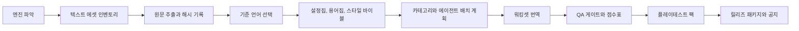

# Game Korean Patch Pipeline

> "처음 보는 게임 폴더"에서 시작해 엔진 파악, 텍스트 추출, 캐릭터별 대사 분리, 95점 품질 게이트, 플레이테스트 인계, 릴리즈 패키징까지 이어 주는 한국어 게임 현지화 스킬입니다.

[](LICENSE)
[](SKILL.md)
[](references/quality-scorecard.md)
[](#실전-프로젝트에서-검증된-흐름)

**언어:** [English](README.md) | 한국어

`game-korean-patch-pipeline`은 Codex/Claude 같은 AI 에이전트가 게임 한글패치 작업을 처음부터 끝까지 재현 가능하게 진행하도록 만든 스킬입니다. 단순 번역 프롬프트가 아니라, 엔진/런타임 파악, 로컬라이제이션 에셋 인벤토리, 기준 언어 선택, 설정집/용어집/말투 카드, 캐릭터별 스크립트 분리, 에이전트 배치 계약, QA 점수표, 릴리즈 패키징까지 하나의 운영 흐름으로 묶습니다.

이 스킬의 철학은 단순합니다. 번역은 빨리 시작할수록 빨리 망가집니다. 먼저 게임이 텍스트를 어디에서 읽는지, 어떤 언어가 어느 표면의 기준인지, 캐릭터가 실제로 누구인지, 어떤 QA를 통과해야 릴리즈 가능한지 확정해야 합니다.

## 왜 필요한가

AI로 게임 번역을 시도하면 보통 같은 지점에서 무너집니다.

- 엔진이나 텍스트 저장 구조를 파악하기 전에 번역부터 시작합니다.
- UI, 아이템, 퀘스트, 자막, 대사를 한 배치에 섞습니다.
- 일본어 원문이나 원래 언어가 말투를 더 잘 담고 있는데도 영어만 기준으로 삼습니다.
- 실제 화자 근거가 아니라 key prefix만 보고 캐릭터 말투를 정합니다.
- placeholder 검사는 통과했지만 원문 의미, 런타임 자막, 플랫폼 분기, 릴리즈 패키징을 놓칩니다.

이 저장소는 그런 실패를 줄이기 위한 작업 절차와 산출물 계약을 제공합니다.

## 자동화하는 것

| 영역 | 산출물 |
|---|---|
| 엔진/에셋 발견 | `engine_report`, `localization_asset_inventory`, `extraction_manifest` |
| 번역 기준 언어 선택 | 표면별 기준 언어를 기록하는 `source_language_matrix` |
| 지식 기반 | `lore_packet`, `localization_quality_standard`, `style_bible`, 용어집 |
| 작업 계획 | 카테고리 계획, 위험도, 에이전트 배치 계약 |
| 대사 처리 | 화자 alias registry, scene override, 캐릭터별 workset, unresolved queue |
| 번역 QA | 원문 정확도, 한국어 자연스러움, 용어 일관성, 화자 말투, 기술 보존 |
| 런타임 QA | 플랫폼 분기, 자막 전용 런타임 표면, smoke check |
| 릴리즈 | clean install/restore 검증, 패키지 검증, 한국어 배포 공지 |

## 5개의 95점 품질 게이트

실제 패치 작업에서는 `quality_scorecard`를 유지합니다. 각 항목은 `0`부터 `100`까지 점수화하고, 공개 릴리즈 기준으로는 다섯 항목 모두 `95`점 이상이어야 합니다.

1. **엔진/추출 커버리지**: 엔진 근거, 텍스트 표면, 재현 가능한 추출, 플랫폼 분기, 미확인 에셋 큐.
2. **맥락/기준 언어 통제**: 설정집, 용어집, 스타일 바이블, source-language matrix, fallback 사유.
3. **분류/에이전트 오케스트레이션**: 카테고리 분리, 화자 근거, 배치 계약, 안전한 subagent 출력, 진행률 집계.
4. **한국어 현지화 품질**: 원문 의미, 자연스러운 한국어, 표면별 문체, 용어, 테스터 피드백 루프.
5. **기술/런타임/릴리즈 QA**: placeholder, tag, 런타임 적용, clean baseline 패키징, 릴리즈 메타데이터.

정확한 배점은 [references/quality-scorecard.md](references/quality-scorecard.md)를 보세요.

## 빠른 시작

### 1. Codex 스킬로 설치

Codex 스킬 폴더에 이 저장소를 클론합니다.

```powershell
git clone https://github.com/yuniwon/game-korean-patch-pipeline.git "$env:USERPROFILE\.codex\skills\game-korean-patch-pipeline"
```

이미 설치되어 있다면 업데이트합니다.

```powershell
git -C "$env:USERPROFILE\.codex\skills\game-korean-patch-pipeline" pull --ff-only
```

### 2. 게임 폴더에서 시작

게임 작업 폴더에서 Codex에게 이렇게 요청합니다.

```text
game-korean-patch-pipeline을 사용해서 이 게임의 한글패치를 부트스트랩해줘.
엔진 감지, 로컬라이제이션 에셋 인벤토리, extraction_manifest,
source_language_matrix, 95점 quality_scorecard부터 만들어줘.
```

### 3. 프로젝트 템플릿 복사

[AGENTS.md](AGENTS.md)를 대상 게임 작업 폴더에 복사하고 게임 이름, 플랫폼, 경로, 플랫폼별 분기 정보를 채웁니다.

## 전체 흐름



## 기준 언어 정책

이 스킬은 영어만 기계적으로 번역하지 않습니다.

- 일본어가 존재하고 정렬/품질이 좋다면 대사, 컷신, 감정선, 존대/반말, 농담, 비꼼, 관계 거리감은 일본어를 우선합니다.
- 일본어가 없거나, 품질이 낮거나, 과하게 압축되어 있거나, 원래 언어보다 부정확하다면 원문 또는 가장 신뢰도 높은 언어를 기준으로 삼습니다.
- UI 라벨, 아이템명, 지명, 조작키, 시스템 용어, 퀘스트 조건, 제작 재료명은 확정 한국어 용어집과 원문/영어 근거를 우선합니다.
- 모든 판단은 `source_language_matrix`에 남기고, 충돌하거나 근거가 약한 항목은 evidence queue로 보냅니다.

## 에이전트 배치 계약

subagent에게 작업을 맡기기 전에 배치별 계약을 만듭니다.

```yaml
batch_id: dialogue_zephyria_001
surface: dialogue
risk_tier: high
controlling_source_language: ja
source_paths:
  - extracted/dialogue/zephyria.tsv
required_references:
  - glossary.tsv
  - style_bible.md
  - speaker_evidence_index.tsv
output_schema:
  - key
  - source
  - old_target
  - new_target
  - reason
  - confidence
allowed_actions:
  - propose_changes_only
qa_before_apply:
  - placeholder_preservation
  - source_accuracy
  - speaker_tone
```

subagent는 직접 JSON이나 게임 번들을 고치지 않고 proposal 또는 reviewed changelog를 반환합니다. 최종 병합과 QA는 orchestrator가 담당합니다.

## 저장소 구조

```text
SKILL.md
agents/
  openai.yaml
assets/
  glossary_template.tsv
  lore_template.md
  translation_plan_template.md
  playtest_report_template.tsv
  release_notice_template_ko.md
references/
  workflow.md
  quality-scorecard.md
  research-playbook.md
  glossary-rules.md
  category-design.md
  qa-gates.md
  multi-agent-workflow.md
  font-insertion.md
  adapter-unity.md
  adapter-unreal.md
  adapter-table-files.md
  adapter-retro-rom.md
scripts/
  detect_engine.py
  scan_localization_assets.py
  build_lore_packet.py
  build_translation_plan.py
  build_playtest_report_template.py
  score_translation_risk.py
```

## 실전 프로젝트에서 검증된 흐름

- [Starsand Island Korean Patch](https://github.com/yuniwon/starsand-island-korean-patch): Steam/Xbox 텍스트 분기, 런타임 자막 수정, 런처 업데이트 감지, 릴리즈 ZIP 검증, 한국어 배포 공지.
- [Mirage 7 Korean Patch](https://github.com/yuniwon/mirage7-ko-patch): Unity/Addressables 분석, 추출 계획, 메타데이터 기반 패치 흐름.
- [Moonstone Island Korean Patch](https://github.com/yuniwon/moonstone-island-korean-patch): 카드, 대사, 퀘스트, 패키지, 플레이테스트 운영.

## 안전 규칙

- 번역 단계에서 원본 게임 에셋을 직접 수정하지 않습니다.
- discovery, extraction, lore, style, source-language, batch-contract 게이트 없이 bulk translation을 시작하지 않습니다.
- AI 초안을 최종 한국어로 취급하지 않습니다.
- 더 나은 화자 근거가 있는데 key prefix만 보고 캐릭터 말투를 정하지 않습니다.
- 일반 사용자가 설치/복원에 명령줄 지식이 필요한 공개 패키지를 배포하지 않습니다.
- 명시적 권리가 없는 한 원본 게임 번들, 실행 파일, 전체 데이터 디렉터리를 배포하지 않습니다.

## 라이선스

MIT. 자세한 내용은 [LICENSE](LICENSE)를 확인하세요.
